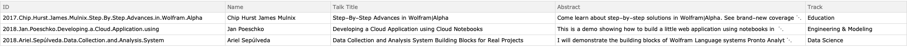
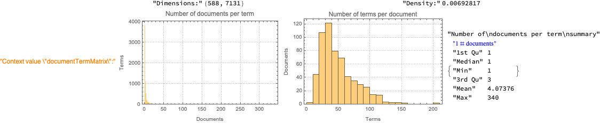
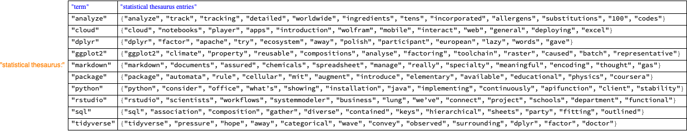
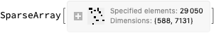
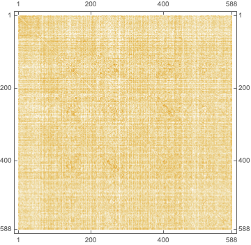

# Conference abstracts similarities

Anton Antonov   
[MathematicaVsR at GitHub](https://github.com/antononcube/MathematicaVsR)   
[MathematicaForPrediction at GitHub](https://github.com/antononcube/MathematicaForPrediction)   
[SimplifiedMachineLearningWorkflow-book at GitHub](https://github.com/antononcube/SimplifiedMachineLearningWorkflows-book)   
January 2020

## Introduction

In this notebook we discuss and exemplify finding and analyzing similarities between texts using Latent Semantic Analysis (LSA).

The LSA workflows are constructed and executed with the software monad LSAMon, \[AA1, AAp1\]. 
A related notebook that uses the same data is [AA2].

The illustrating examples are based on conference abstracts from 
[rstudio::conf](https://rstudio.com/conference/) 
and 
[Wolfram Technology Conference (WTC)](https://www.wolfram.com/events/technology-conference/2019/), 
\[AAd1, AAd2\]. 
Since the number of rstudio::conf abstracts is small and since rstudio::conf 2020 is about to start 
at the time of preparing this notebook we focus on words and texts from R / RStudio ecosystem of packages and presentations.

This notebook is part of the 
[MathematicaVsR at GitHub](https://github.com/antononcube/MathematicaVsR) 
project 
[“Conference abstracts similarities”](https://github.com/antononcube/MathematicaVsR/tree/master/Projects/ConferenceAbstactsSimilarities), 
\[[AAr1](https://github.com/antononcube/MathematicaVsR)\].

### Summary of the computations

   0. Ingest the abstracts data from both conferences.

      0. rstudio::conf 2019.

      0. WTC 2016÷2019.

   0. Apply the standard LSA workflow using LSAMon.

      0. Pick a suitable dimension reduction algorithm by evaluating extracted topics and statistical thesauri.

      0. The statistical thesauri are based on typical R-ecosystem words.

   0. Compute, summarize, and visualize abstract-abstract similarity matrices.

      0. Terms-derived.

      0. Topics-derived.

   0. Find clusters of abstracts using a relational graph made with the topics similarity matrix.

      0. Look closer into a cluster with a fair amount of rstudio::conf abstracts.

   0. Find the Nearest Neighbors (NN's) of a selected rstudio::conf abstract using the topics similarity matrix.

      0. Demonstrate the similarity from LSA’s point of view.

## Data

We have a “large” dataset of $584$ WTC abstracts, and a “small” dataset of $61$ rstudio::conf abstracts.

The abstracts datasets [AAd1] and [AAd2] are provided in [the data folder](https://github.com/antononcube/SimplifiedMachineLearningWorkflows-book/tree/master/Data) of the (book) repository, [[AAr2](https://github.com/antononcube/SimplifiedMachineLearningWorkflows-book/)].

### Read rstudio-conf-2019 abstracts

```mathematica
dsRSCAbstracts=ResourceFunction["ImportCSVToDataset"]["https://raw.githubusercontent.com/antononcube/SimplifiedMachineLearningWorkflows-book/master/Data/RStudio-conf-2019-abstracts.csv"];
    Length[dsRSCAbstracts]

(*61*)
```

```mathematica
aRSCAbstracts=Association@Normal@dsRSCAbstracts[All,#ID->#Abstract&];
```

```mathematica
SeedRandom[23];
    RandomSample[dsRSCAbstracts,3]
```


### Read WTC-2019 abstracts

```mathematica
dsWTCAbstracts=ResourceFunction["ImportCSVToDataset"]["https://raw.githubusercontent.com/antononcube/SimplifiedMachineLearningWorkflows-book/master/Data/Wolfram-Technology-Conference-2016-to-2019-abstracts.csv"];
    Length[dsWTCAbstracts]

(*584*)
```

```mathematica
dsWTCAbstracts=dsWTCAbstracts[Select[StringQ[#Abstract]&&StringLength[#Abstract]>100&]];
    Length[dsWTCAbstracts]

(*530*)
```

```mathematica
aWTCAbstracts=Association@Normal@dsWTCAbstracts[All,#ID->#Abstract&];
```

```mathematica
SeedRandom[23];
    RandomSample[dsWTCAbstracts,3]
```



## LSA monad application

### Focus words

For the evaluation of the dimension reduction methods applicability we are going to use the following focus words:

```mathematica
focusWords={"cloud","rstudio","package","tidyverse","dplyr","analyze","python","ggplot2","markdown","sql"};
```

### LSA monad object

Join the abstracts from the two conferences:

```mathematica
aDesriptions=Join[aRSCAbstracts,aWTCAbstracts];
```

```mathematica
lsaObj=
    LSAMonUnit[aDesriptions]⟹
    LSAMonMakeDocumentTermMatrix[{},Automatic]⟹
    LSAMonEchoDocumentTermMatrixStatistics⟹
    LSAMonApplyTermWeightFunctions["IDF","TermFrequency","Cosine"];
```



### Topics extraction

After some experimentation we chose to use Independent Component Analysis (ICA) as a dimension reduction method because produces the most sensible entries for the focus words. 

```mathematica
SeedRandom[668];
    lsaObj=
    lsaObj⟹
    LSAMonExtractTopics["NumberOfTopics"->36,"MinNumberOfDocumentsPerTerm"->2,Method->"ICA",MaxSteps->200]⟹
    LSAMonEchoTopicsTable["NumberOfTableColumns"->6];
```


### Statistical thesauri

With the selected ICA method we get the following statistical thesauri entries:

```mathematica
lsaObj⟹
    LSAMonEchoStatisticalThesaurus["Words"->focusWords];
```


Here we see another statistical entries computed with Non-Negative Matrix Factorization (NNMF): 

```mathematica
SeedRandom[132];
    lsaObj⟹
    LSAMonExtractTopics["NumberOfTopics"->36,"MinNumberOfDocumentsPerTerm"->2,Method->"NNMF",MaxSteps->20]⟹
    LSAMonEchoStatisticalThesaurus["Words"->focusWords];
```



Remark: By examining the statistical thesauri we prefer to ICA over NNMF below. The ICA results seem more “R-flavored.”

## Similarity matrices

In this section we compute and plot the similarity matrices based on (i) linear vector space representation, and (ii) LSA topics representation.

### By terms

```mathematica
smat=lsaObj⟹LSAMonTakeWeightedDocumentTermMatrix
```



```mathematica
RowNames[smat][[1;;65]]

(*{"id.001","id.002","id.003","id.004","id.005","id.006","id.007","id.008","id.009","id.010","id.011","id.012","id.013","id.014","id.015","id.016","id.017","id.018","id.019","id.020","id.021","id.022","id.023","id.024","id.025","id.026","id.027","id.028","id.029","id.030","id.031","id.032","id.033","id.034","id.035","id.036","id.037","id.038","id.040","id.041","id.042","id.043","id.044","id.045","id.046","id.047","id.048","id.049","id.050","id.051","id.053","id.055","id.056","id.057","id.060","id.061","id.052","id.054","id.059","id.062","id.063","2016.Abraham.Gadalla.Save.your.time.and.your","2016.George.Danner.Talking.to.Models","2016.Faisal.Whelpley.Automated.Test.Generator","2016.Enrique.Vílchez.Quesada.Vil.Cretas..package.educational"}*)
```

#### Visualization

```mathematica
matTermSim=smat.Transpose[smat];
    matTermSim=matTermSim-DiagonalMatrix[Diagonal[SparseArray[matTermSim]]];
    MatrixPlot[matTermSim]
```



```mathematica
ResourceFunction["RecordsSummary"][Flatten[SparseArray[matTermSim]]]
```


### By topics

Here we normalize the matrix factors first and then take the left matrix factor:

```mathematica
lsaObj=lsaObj⟹LSAMonNormalizeMatrixProduct[Normalized->Left];
    smat=lsaObj⟹LSAMonTakeW;
```

Here normalize each row of the matrix using Euclidean norm:

```mathematica
smat=WeightTermsOfSSparseMatrix[smat,"None","None","Cosine"]
```


We can see that the first 61 rows of that matrix correspond to rstudio::conf abstract ID’s:

```mathematica
RowNames[smat][[1;;61]]

(*{"id.001","id.002","id.003","id.004","id.005","id.006","id.007","id.008","id.009","id.010","id.011","id.012","id.013","id.014","id.015","id.016","id.017","id.018","id.019","id.020","id.021","id.022","id.023","id.024","id.025","id.026","id.027","id.028","id.029","id.030","id.031","id.032","id.033","id.034","id.035","id.036","id.037","id.038","id.040","id.041","id.042","id.043","id.044","id.045","id.046","id.047","id.048","id.049","id.050","id.051","id.053","id.055","id.056","id.057","id.060","id.061","id.052","id.054","id.059","id.062","id.063"}*)
```

Here we compute the similarity matrix:

```mathematica
matTopicsSim=smat.Transpose[smat];
    matTopicsSim=matTopicsSim-DiagonalMatrix[Diagonal[SparseArray[matTopicsSim]]];
```

Here is the summary of the non-zero values of the similarity matrix:

```mathematica
ResourceFunction["RecordsSummary"][Flatten[SparseArray[matTopicsSim]]]
```


#### Visualization

Here we visualize the similarity matrix:

```mathematica
MatrixPlot[matTopicsSim]
```


Remark: Note the top left rectangle that indicates high similarity -- the rows and columns of that rectangle correspond to the rstudio::conf abstracts. 

Here we sort the matrix rows and columns first and then plot:

```mathematica
matTopicsSim2=matTopicsSim[[Reverse@Ordering[Normal@SparseArray[matTopicsSim]],Reverse@Ordering[Normal@Transpose@SparseArray[matTopicsSim]]]];MatrixPlot[matTopicsSim2]
```


## Abstracts clustering by topics

Here we select only the rstudio::conf 2019 abstract ID’s:

```mathematica
focusIDs=Flatten[StringCases[RowNames[matTopicsSim],"id.0"~~__]]

(*{"id.001","id.002","id.003","id.004","id.005","id.006","id.007","id.008","id.009","id.010","id.011","id.012","id.013","id.014","id.015","id.016","id.017","id.018","id.019","id.020","id.021","id.022","id.023","id.024","id.025","id.026","id.027","id.028","id.029","id.030","id.031","id.032","id.033","id.034","id.035","id.036","id.037","id.038","id.040","id.041","id.042","id.043","id.044","id.045","id.046","id.047","id.048","id.049","id.050","id.051","id.053","id.055","id.056","id.057","id.060","id.061","id.052","id.054","id.059","id.062","id.063"}*)
```

Here we summarize the non-zero values of the topics similarity matrix:

```mathematica
ResourceFunction["RecordsSummary"][SparseArray[matTopicsSim]["NonzeroValues"]]
```


Here we put to zero similarity values under a certain threshold:

```mathematica
matTopicsSim2=Clip[matTopicsSim,{0.75,1},{0,1}];
```

Here we use an LSAMon workflow to compute an NN’s graph between the abstracts:

```mathematica
gr=LSAMonUnit[]⟹LSAMonSetValue[matTopicsSim2]⟹LSAMonMakeGraph["Type"->"DocumentDocument","Weighted"->False]⟹LSAMonTakeValue
```


Here we find graph communities -- i.e. clusters of abstracts:

```mathematica
coms=FindGraphCommunities[gr,Method->"Spectral"];
```

Choose the cluster with the most rstudio::conf abstracts:

```mathematica
focusCom=TakeLargestBy[coms,Length[Intersection[#,focusIDs]]&,2][[1]];
    Shallow[focusCom]

(*{"id.011","id.014","id.016","id.025","id.040","id.049","2018.John.Odden.GIST..Health.Care.Guidelines.Simplicity.CDF","2018.Maureen.Baehr.Ben.Kickert.Analyzing.Public.Data.with.Wolfram.","id.043","id.054",\[LeftSkeleton]15\[RightSkeleton]}*)
```

Highlight the chosen cluster in the NN’s graph:

```mathematica
HighlightGraph[gr,Subgraph[gr,focusCom]]
```


Show the rstudio::conf abstracts in the cluster:

```mathematica
Take[dsRSCAbstracts[Select[MemberQ[focusCom,#ID]&]],UpTo[6]]
```


Show the WTC abstracts in the cluster:

```mathematica
Take[dsWTCAbstracts[Select[MemberQ[focusCom,#ID]&]],UpTo[6]]
```


Remark: Note the semantic similarity between the rstudio::conf and WTC abstracts!

Using graph communities further cluster the abstracts in the cluster:

```mathematica
CommunityGraphPlot[Subgraph[gr,focusCom],Method->"Spectral",VertexLabels->Placed["Name",Above,Tooltip],AspectRatio->1,ImageSize->Large]
```


Remark: Note the rstudio::conf abstracts form separate communities. This fits the observations over the topics-derived similarity matrix.

## Nearest neighbors for a focus abstract

In this section we look closer into the Nearest Neighbors (NN’s) of an arbitrarily picked rstudio::conf abstract. We want to demonstrate the semantic similarity of the found NN’s -- both from rstudio::conf and WTC.

Consider the following abstract from rstudio::conf 2019:

```mathematica
focusID="id.019";
focusAbstract=Normal[dsRSCAbstracts[Select[#ID==focusID&],"Abstract"]][[1]]

(*"Of the many coding puzzles on the web, few focus on the programming skills needed for handling untidy data. During my summer internship at RStudio, I worked with Jenny Bryan to develop a series of data science puzzles known as the \[OpenCurlyDoubleQuote]Tidies of March.\[CloseCurlyDoubleQuote] These puzzles isolate data wrangling tasks into bite-sized pieces to nurture core data science skills such as importing, reshaping, and summarizing data. We also provide access to puzzles and puzzle data directly in R through an accompanying Tidies of March package. I will show how this package models best practices for both data wrangling and project management."*)
```

Abstract’s talk is clearly about data science workflows. The word “workflow” does not appear in the abstract:

```mathematica
StringCases[focusAbstract,"workflow",IgnoreCase->True]

(*{}*)
```

Nevertheless, NN’s of the focus rstudio::conf abstract contain WTC abstracts about data science workflows:

```mathematica
nns=Keys@TakeLargest[ColumnSumsAssociation[matTopicsSim[[{focusID},All]]],12]

(*{"id.008","id.031","id.014","id.048","id.004","id.061","id.005","id.017","id.012","2019.Matt.Klimuszka.Gosia.Konwerska.PhD.and.Etienne.Bernard.Meet.Up.Data.Science.Workflows.Wolfram","id.040","2018.Maureen.Baehr.Ben.Kickert.Analyzing.Public.Data.with.Wolfram."}*)
```

```mathematica
MatrixPlot[matTopicsSim[[nns,nns]]]
```


Here are the found top four rstudio::conf abstracts NN’s:

```mathematica
ResourceFunction["GridTableForm"][Take[KeyTake[aRSCAbstracts,nns],UpTo[3]]]
```


Here are the found WTC abstracts NN’s: 

```mathematica
ResourceFunction["GridTableForm"][Take[KeyTake[aWTCAbstracts,nns],UpTo[3]]]
```


## References

### Articles

[AA1] Anton Antonov, 
[A monad for Latent Semantic Analysis workflows](https://github.com/antononcube/MathematicaForPrediction/blob/master/MarkdownDocuments/A-monad-for-Latent-Semantic-Analysis-workflows.md), 
(2019), 
[MathematicaForPrediction at GitHub](https://github.com/antononcube/MathematicaForPrediction).

[AA2] Anton Antonov, Text similarities through bags of words, (2020), 
[SimplifiedMachineLearningWorkflows-book at GitHub](https://github.com/antononcube/SimplifiedMachineLearningWorkflows-book).

### Data

[AAd1] Anton Antonov, 
[RStudio::conf-2019-abstracts.csv](https://github.com/antononcube/SimplifiedMachineLearningWorkflows-book/blob/master/Data/RStudio-conf-2019-abstracts.csv), 
(2020), 
[SimplifiedMachineLearningWorkflows-book at GitHub](https://github.com/antononcube/SimplifiedMachineLearningWorkflows-book).

[AAd2] Anton Antonov, 
[Wolfram-Technology-Conference-2016-to-2019-abstracts.csv](https://github.com/antononcube/SimplifiedMachineLearningWorkflows-book/blob/master/Data/Wolfram-Technology-Conference-2016-to-2019-abstracts.csv), 
(2020), 
[SimplifiedMachineLearningWorkflows-book at GitHub](https://github.com/antononcube/SimplifiedMachineLearningWorkflows-book).

### Packages & repositories

[AAp1] Anton Antonov, 
[Monadic Latent Semantic Analysis Mathematica packag](https://github.com/antononcube/MathematicaForPrediction/blob/master/MonadicProgramming/MonadicLatentSemanticAnalysis.m),
(2017), 
[MathematicaForPrediction at GitHub](https://github.com/antononcube/MathematicaForPrediction).

[AAr1] Anton Antonov,  [MathematicaVsR](https://github.com/antononcube/MathematicaVsR), 2016, GitHub.

[AAr2] Anton Antonov, [Simplified Machine Learning Workflows](https://github.com/antononcube/SimplifiedMachineLearningWorkflows-book), 2019, GitHub.

